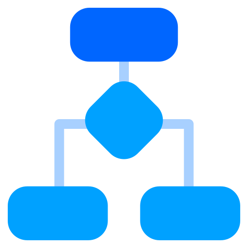

# Drules

[](https://github.com/dizitart/drules/actions/workflows/build.yml)
[](https://codecov.io/gh/dizitart/drules)
[](https://pub.dev/packages/drules)
[](https://github.com/dizitart/drules/discussions)

<p align="center">
    
</p>

Drules is a simple rule engine for Dart. It allows you to define rules in Json format and execute them against a given context. The rules are defined in a simple Json format and can be easily extended to support more complex rules. 

## Usage

To use Drules in your Dart code, add it as a dependency in your project.

```bash
dart pub add drules
```

A simple usage example:

```dart
import 'package:drules/drules.dart';

void main() async {
  var jsonRules =
  [
    '''
    {
        "name": "rule1",
        "conditions": {
          "operator": ">",
          "operands": ["age", 18]
        },
        "actionInfo": {
            "onSuccess": {
                "operation": "print",
                "parameters": ["You are an adult"]
            }
        }
    }
    ''',
    '''
    {
        "name": "rule2",
        "conditions": {
          "operator": "<",
          "operands": ["age", 18]
        },
        "actionInfo": {
            "onSuccess": {
                "operation": "print",
                "parameters": ["You are a child as your age is ${age}"]
            }
        }
    }
    ''' 
  ];

  var ruleRepository = StringRuleRepository(jsonRules);
  var ruleEngine = RuleEngine(ruleRepository);

  var context = RuleContext();
  context.addFact("age", 20);

  await ruleEngine.run(context);

}
```

## Features

- Simple rule definition in Json format
- Support for basic conditions and actions
- Easily extensible to support more complex rules
- Support for asynchronous actions
- Support for custom actions
- Support for custom conditions


## Rules

A rule is defined in a simple Json format. A rule consists of the following fields:

- `id`: The unique identifier of the rule. The id will be automatically generated if not provided.
- `name`: The name of the rule. This is optional and can be used for debugging purposes.
- `priority`: The priority of the rule. The rules are executed in the order of their priority. The default priority is 0.
- `enabled`: A flag to indicate whether the rule is enabled or not. The default value is true.
- `conditions`: The conditions that need to be satisfied for the rule to be executed. More details about conditions are provided [below](#conditions).
- `actionInfo`: Information about the actions to be executed when the rule is activated. The actionInfo is defined in the following format:
    - `onSuccess`: The action to be executed when the rule is successful.
        - `operation`: The operation to be executed.
        - `parameters`: The parameters to be passed to the operation.
    - `onFailure`: The action to be executed when the rule execution fails due to an error.
        - `operation`: The operation to be executed.
        - `parameters`: The parameters to be passed to the operation.

## Conditions

A condition consists of the following fields:

- `operator`: The operator to be used to evaluate the condition. It can be one of the following built-in operators or any user-defined operator:

    - `==`: Equal to
    - `!=`: Not equal to
    - `>`: Greater than
    - `<`: Less than
    - `>=`: Greater than or equal to
    - `<=`: Less than or equal to
    - `!`: Negation of the operand
    - `all`: All operands must be true
    - `any`: Any operand must be true
    - `none`: None of the operands must be true
    - `contains`: The first operand must contain the second operand
    - `startsWith`: The first operand must start with the second operand
    - `endsWith`: The first operand must end with the second operand
    - `matches`: The first operand must match the regular expression in the second operand
    - `expression`: The first operand must evaluate to true using the expression in the second operand

- `operands`: A list of operands to be used in the evaluation.

### Examples

#### Simple condition

```json
{
    "operator": ">",
    "operands": ["age", 18]
}
```

#### Complex condition

```json
{
    "operator": "all",
    "operands": [
        {
            "operator": ">",
            "operands": ["age", 18]
        },
        {
            "operator": "<",
            "operands": ["age", 60]
        }
    ]
}
```

#### Expression condition

Drules supports expression conditions. The expression condition allows you to define a custom expression to evaluate the condition. It uses the [template_expressions](https://pub.dev/packages/template_expressions) package to evaluate the expression. 

If you want to use Dart objects in the expression, you have to pass the `MemberAccessor` object to the `RuleContext` object. The `MemberAccessor` object provides access to the fields/methods of the Dart objects in the expression.

```dart
// user defined object
class Counter {
  int _value;

  Counter(this._value);

  void increment() {
    _value++;
  }

  int get value => _value;
}

var context = RuleContext(resolve: [
    MemberAccessor<Counter>({
        'value': (c) => c.value,
        'increment': (c) => c.increment,
    }),
]);
context.addFact('counter', Counter(2));
```

The expression condition is defined in the following format:

```json
{
    "operator": "expression",
    "operands": ["counter.value == 2"]
}
```

#### Custom condition

A custom condition can be defined by extending the `Condition` class. It must be registered with the `RuleEngine` object to be used in the rules.

```dart
ruleEngine.registerCondition(CustomCondition('isEven', (operands, context) {
    return operands[0] % 2 == 0;
}));
```

Then it can be used in the rules as follows:

```json
{
    "operator": "isEven",
    "operands": [2]
}
```

## Actions

An action consists of the following fields:

- `operation`: The operation to be executed. The operation can be one of the following built-in operations or any user-defined operation:

    - `print`: Prints the output to the console.
    - `expression`: Evaluates a Dart expression.
    - `stop`: Stops further execution of the rule or other actions in the pipeline.
    - `chain`: All actions in the chain must be executed in the order they are defined.
    - `parallel`: All actions in the parallel block must be executed in parallel.
    - `pipe`: The output of one action is passed as input to the next action.

- `parameters`: The parameters to be passed to the operation.

### Examples

#### Print action

```json
{
    "operation": "print",
    "parameters": ["You are an adult"]
}
```

#### Expression action

Drules supports expression actions. The expression action allows you to define a custom expression to evaluate the action. It uses the [template_expressions](https://pub.dev/packages/template_expressions) package to evaluate the expression.

Similar to the expression condition, you have to set the `MemberAccessor` object in the `RuleContext` object to use Dart objects in the expression.

```json
{
    "operation": "expression",
    "parameters": ["counter.increment()"]
}
```

#### Custom action

A custom action can be defined by extending the `Action` class or by using the `CustomAction` class. It must be registered with the `RuleEngine` object to be used in the rules.

```dart
ruleEngine.registerAction(CustomAction('log', (parameters, context) {
    print(parameters[0]);
}));
```
Then it can be used in the rules as follows:

```json
{
    "operation": "log",
    "parameters": ["You are an adult"]
}
```

## Rule Context

The `RuleContext` object is used to store the facts and the `MemberAccessor` objects. The `MemberAccessor` object provides access to the fields/methods of the Dart objects in the expression.

```dart
var context = RuleContext(resolve: [
    MemberAccessor<Counter>({
        'value': (c) => c.value,
        'increment': (c) => c.increment,
    }),
], facts: {
    'counter': Counter(2),
});
```

## Rule Repository

The `RuleRepository` object is used to store the rules. 

### StringRuleRepository

The `StringRuleRepository` object is a simple implementation of the `RuleRepository` interface that stores the rules in a list of strings.

```dart
var jsonRules = [
    '''
    {
        "name": "rule1",
        "conditions": {
            "operator": ">",
            "operands": ["age", 18]
        },
        "actionInfo": {
            "onSuccess": {
                "operation": "print",
                "parameters": ["You are an adult"]
            }
        }
    }
    '''
];

var ruleRepository = StringRuleRepository(jsonRules);
```

### FileRuleRepository

The `FileRuleRepository` object is an implementation of the `RuleRepository` interface that reads the rules from files or directory.

```dart
var ruleRepository = FileRuleRepository(
    fileNames: [
        'rules/rule_one.json',
        'rules/rule_two.json',
    ],
);
```

## Activation events

Drules supports activation events. An activation event is a signal that triggers the execution of the rules. The activation event contains information about the rule that was activated, the facts that triggered the rule, and the result of the rule.

To listen to the activation events, you can add a listener to the `RuleEngine` object.

```dart
ruleEngine.addListener((event) {
    print(event);
});
```

Or you can use (+) operator to add a listener.

```dart
ruleEngine + print;
```

## Bugs and feature requests

Please file feature requests and bugs at the [issue tracker](https://github.com/dizitart/drules/issues). 

## License

Drules is released under the [Apache License v2](LICENSE).

## Support

If you like this package and want to support our opensource work, consider sponsoring us via [GitHub Sponsors](https://github.com/sponsors/anidotnet). 

Also consider supporting it by giving a star on [GitHub](https://github.com/dizitart/drules) and a like on [pub.dev](https://pub.dev/packages/drules).

## Contribution

If you would like to contribute to this project, please feel free to send a pull request.

## Logo Attribution

<a href="https://www.flaticon.com/free-icons/business-and-finance" title="business and finance icons">Business and finance icons created by bukeicon - Flaticon</a>

